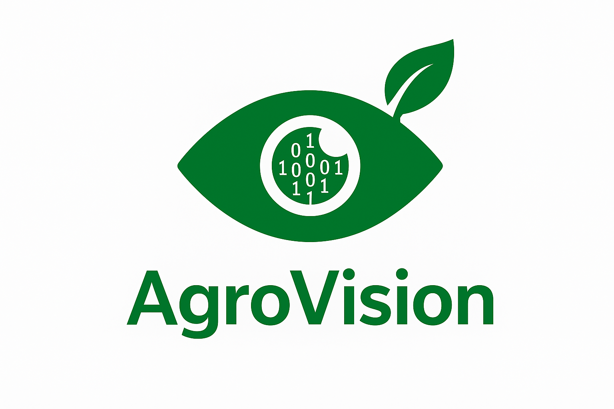

<p align="center">
  
</p>

# AgroVision - Dashboard Agrícola PWA

AgroVision é uma aplicação web progressiva (PWA) moderna para gestão de culturas agrícolas, desenvolvida com Next.js e projetada para funcionar tanto com dados mock quanto com APIs externas.

## 🌾 Funcionalidades

- **Dashboard Interativo**: KPIs e painéis para monitoramento de culturas (Soja, Milho, Café)
- **Cálculo de Área**: Ferramenta para calcular área de plantio (retângulo mínimo)
- **Manejo de Insumos**: Cálculo de insumos necessários por cultura
- **Integração com APIs**: Suporte para consumo de endpoints Python/R
- **PWA Completo**: Funciona offline com service worker e manifest
- **Design Responsivo**: Interface otimizada para desktop e mobile

## 🚀 Instalação e Execução

### Pré-requisitos
- Node.js 16+ 
- npm ou yarn

### Configuração

1. Clone o projeto e instale as dependências:
```bash
npm install
```

2. Configure as variáveis de ambiente:
```bash
cp .env.local.example .env.local
```

3. Execute o projeto:
```bash
npm run dev
```

4. Acesse: `http://localhost:3000`

## ⚙️ Configuração de Ambiente

### Variáveis Principais (.env.local)

```bash
# API Configuration
NEXT_PUBLIC_API_URL=http://localhost:8000
USE_MOCK=false

# Firebase (opcional - para persistência local)
NEXT_PUBLIC_FB_API_KEY=sua_api_key
NEXT_PUBLIC_FB_AUTH_DOMAIN=seu_project.firebaseapp.com
NEXT_PUBLIC_FB_PROJECT_ID=seu_project_id
# ... outras chaves Firebase
```

### Modos de Operação

#### 1. Modo Mock (Padrão)
- **Configuração**: `USE_MOCK=true` ou `NEXT_PUBLIC_API_URL` vazio
- **Comportamento**: Usa dados de teste pré-definidos
- **Ideal para**: Desenvolvimento e testes

#### 2. Modo API Externa
- **Configuração**: Definir `NEXT_PUBLIC_API_URL` e `USE_MOCK=false`
- **Comportamento**: Consome endpoints da aplicação Python
- **Fallback**: Retorna para mock se API falhar

## 🔌 Integração com APIs

### Endpoints Esperados

#### 1. Estatísticas
```http
POST /analytics/stats
Content-Type: application/json

{
  "valores": [28, 35, 22]
}
```

**Resposta:**
```json
{
  "n": 3,
  "media": 28.33,
  "desvio": 6.51,
  "min": 22,
  "max": 35
}
```

#### 2. Resumo Climático
```http
POST /weather/summary
Content-Type: application/json

{
  "lat": -23.5505,
  "lon": -46.6333,
  "dias": 7
}
```

**Resposta:**
```json
{
  "precipitacao_total_mm": 85,
  "temperatura_media_c": 24.5,
  "umidade_media_pct": 68,
  "dias": 7
}
```

### Exemplo de Configuração da API Python

Se você estiver usando uma aplicação Python (Flask/FastAPI) que orquestra o R:

```python
# Exemplo para Flask
@app.route('/analytics/stats', methods=['POST'])
def get_stats():
    data = request.json
    # Processar com R
    result = r_analytics.calculate_stats(data['valores'])
    return jsonify(result)
```

## 📱 PWA Features

### Service Worker
- Cache first para arquivos estáticos
- Network first para chamadas de API
- Funciona offline com fallback para mock

### Manifest
- Instalável como app nativo
- Ícones otimizados (192x192, 512x512)
- Tema personalizado com paleta AgroVision

### Instalação
Os usuários podem instalar o app através do navegador:
- Chrome: "Instalar AgroVision"
- Safari: "Adicionar à Tela Inicial"

## 🎨 Design System

### Paleta de Cores
- **Primary**: `#003840` (Verde escuro)
- **Secondary**: `#005A5B` (Verde médio)
- **Accent**: `#007369` (Verde água)
- **Success**: `#008C72` (Verde claro)
- **Light**: `#02A676` (Verde limão)

### Componentes
- `StatCard`: Cards de KPI com ícones
- `Panel`: Painéis de conteúdo
- `CultureSelect`: Seletor visual de culturas
- `ApiStatusToggle`: Indicador de modo (Mock/API)

## 📊 Dados Mock

### Registros de Teste
```javascript
[
  {
    id: "A1",
    cultura: "Café",
    ruas: 120,
    comp_rua_m: 80,
    dose_ml_m: 500,
    area_ha: 4.2,
    chuva_mm: 28,
    produto: "Fosfato"
  },
  {
    id: "B2", 
    cultura: "Soja",
    area_ha: 12.0,
    dose_l_ha: 2.5,
    chuva_mm: 35,
    produto: "Herbicida"
  },
  {
    id: "C3",
    cultura: "Milho", 
    area_ha: 7.5,
    dose_l_ha: 2.0,
    chuva_mm: 22,
    produto: "Inseticida"
  }
]
```

## 🔧 Estrutura do Projeto

```
/
├── app/                    # App Router (Next.js 13+)
│   ├── calc/
│   │   ├── area/          # Calculadora de área
│   │   └── insumos/       # Calculadora de insumos  
│   ├── globals.css        # Estilos globais
│   ├── layout.tsx         # Layout principal
│   └── page.tsx           # Dashboard
├── components/
│   ├── layout/            # Componentes de layout
│   ├── providers/         # Providers (PWA)
│   └── ui/                # Componentes de interface
├── lib/                   # Utilidades
├── services/              # Serviços de API
├── public/                # Assets estáticos
│   ├── manifest.json      # PWA manifest
│   └── sw.js             # Service worker
└── README.md
```

## 🚀 Deploy

### Build para Produção
```bash
npm run build
```

### Configuração para Deploy
O projeto está configurado para export estático (`output: 'export'`), compatível com:
- Vercel
- Netlify  
- GitHub Pages
- Qualquer servidor estático

## 🔍 Troubleshooting

### API não conecta
1. Verifique se `NEXT_PUBLIC_API_URL` está correto
2. Confirme se a aplicação Python está rodando
3. Verifique CORS na API
4. O app automaticamente usa mock se API falhar

### PWA não instala
1. Serve em HTTPS (localhost é exceção)
2. Verifique se `manifest.json` está acessível
3. Confirme se service worker registrou

### Estilos não carregam
1. Execute `npm run build` após mudanças CSS
2. Verifique se Tailwind está processando as classes
3. Limpe cache do navegador

## 📄 Licença

Este projeto é livre para uso educacional e comercial.

---

**AgroVision** - Transformando dados agrícolas em insights inteligentes 🌱